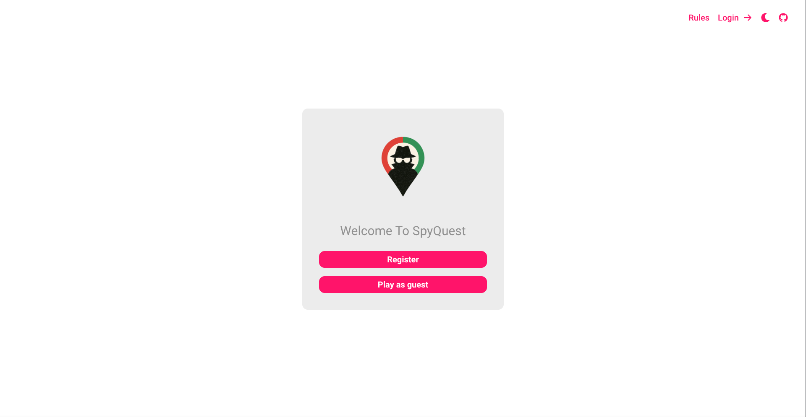
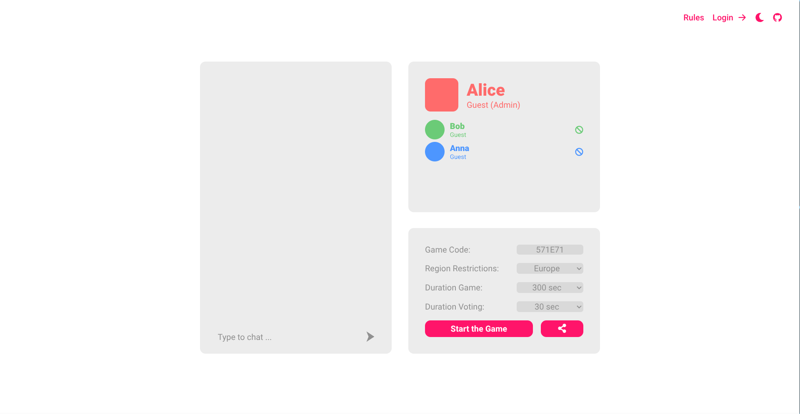
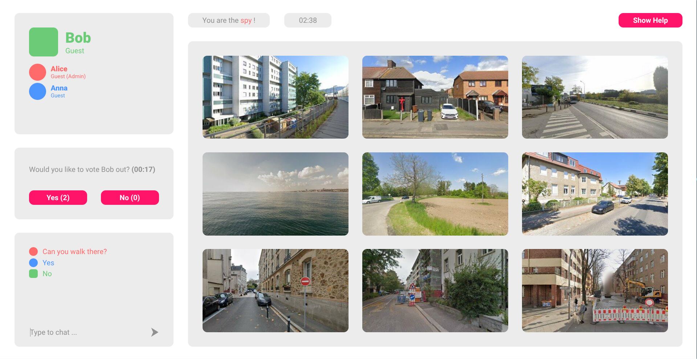
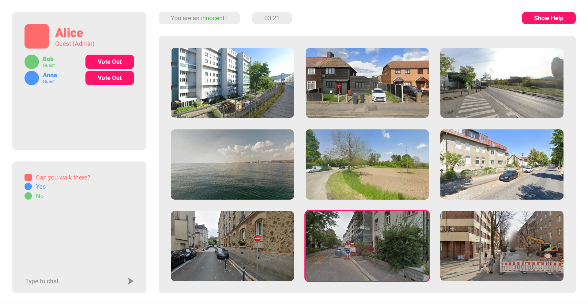
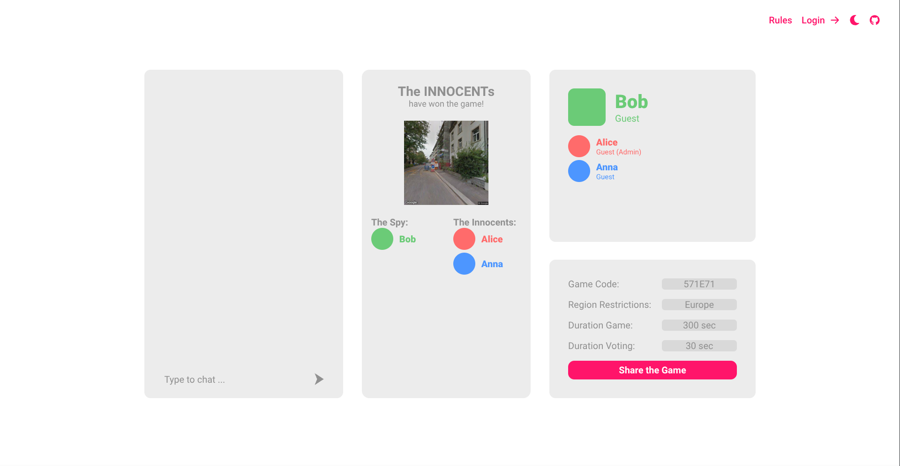

## SpyQuest

Welcome to SpyQuest, a web-based multiplayer deduction game that combines strategic thinking with real-time communication. Players can create or enter game rooms using unique room codes and participate in image-based deduction rounds supported by a live chat and voting system. The game features customisable settings, permanent stat tracking and a seamless cross-platform experience.

## Table of Contents

- [Introduction](#introduction)
- [Technologies](#technologies)
- [High-level components](#high-level-components)
- [Launch & Deployment](#launch--deployment)
- [Illustrations](#illustrations)
- [Roadmap](#Roadmap)
- [Authors & Acknowledgement](#authors--acknowledgement)
- [Licence](#license)

## Introduction

### Project Goal

SpyQuest is a multiplayer social deduction game that delivers a strategic gameplay experience through real-time interaction and deduction challenges. Among all players, one is secretly assigned the role of the spy, while the others play as innocents, where none knowing each other's roles. The spy's objective is to correctly identify the target image from a grid of nine possibilities without being detected before the round timer expires. Meanwhile, the innocents aim to uncover and vote out the spy. Players must ask each other questions to gather information but innocents must be careful not to reveal too much about the target picture, while the spy must avoid sounding too vague and arousing suspicion.

### Motivation

We wanted to make a social deduction game that feels more immersive and fun than just reading plain text or talking in circles as the most games are this way. That is why SpyQuest uses real Street View images, making the game feel more real and give players something visible to talk about. Playing the game right in the browser means no installs or setup, so anyone can jump in quickly. The built-in chat (with handy @ mentions) helps keep the game organized and fair, especially when playing remotely or with new people. It keeps things flowing without needing voice calls or external tools.

## Technologies

For the Client part of our application, we relied on the following tech stack:

- [TypeScript](https://www.typescriptlang.org/docs/): programming language
  programming language
- [CSS](https://devdocs.io/css/): For style
- [Next.js](https://nextjs.org/): React Framework
- [Stomp](https://stomp-js.github.io/stomp-websocket/): For websocket communication
- [Google Maps Streetview API](https://developers.google.com/maps/documentation/javascript/streetview?hl=de): For images in the game
- [Figma](https://www.figma.com/): For Mockups

## High-level components

### Home([page.tsx](https://github.com/sopra-fs25-group-20/sopra-fs25-group-20-client/blob/main/app/page.tsx))

The `Home` page is the first page you see when you launch SpyQuest. From here you can register/Login via `Register` as a User or play as a guest via `Play as guest`. If you choose to play as a guest no user stats are safed to the profile.

### Lobby([lobby.tsx](https://github.com/sopra-fs25-group-20/sopra-fs25-group-20-client/blob/main/app/game/%5Bcode%5D/lobby.tsx))

In the `Lobby` page, on the left side players can chat with each others and on the top right they can see an overview of all the players currently in the `GameRoom`. On the bottom right hand side the `admin` of the Room can change the game settings based on region restrictions, game duration and voting duration. Via the `share icon` the room code can be copied and via the `Start the Game` button the round begins.

### Game([play.tsx](https://github.com/sopra-fs25-group-20/sopra-fs25-group-20-client/blob/main/app/game/%5Bcode%5D/play.tsx))

In the `Game` page is where the gameplay happens. On the top left side of the screen users can see the current players in the room and right below they can talk and ask questions via the in-game chat feature. On the right side nine pictures are displayed, for the innocents the target image is highlighted and the role assigned can be found on the top as well as the round timer. As the Spy, clicking on an image lets you select it as the target and submit your guess. With the `Vote Out` button you can initiate a voting session to vote out a suspicious player (the spy) and by clicking the `Show Help` button a drop down description is shown depending on your role.

### Game Summary([lobby.tsx](https://github.com/sopra-fs25-group-20/sopra-fs25-group-20-client/blob/main/app/game/%5Bcode%5D/lobby.tsx))

In the `Game Summary` page the winner is displayed as well as the role of every player. On the top right players can also see the overview of players as well as their aggregated wins underneath, depending wether they are registered or not and on the bottom right the admin can start another game by clicking the `Start the Game` button or change the game settings.

## Launch & Deployment

### How to Run

Deploy the frontend using Docker.

### **Run with Default Backend**

By default, the frontend connects to the live backend:

```bash
docker run -p 3000:3000 ghcr.io/sopra-fs25-group-20/sopra-fs25-group-20-client:latest
```

### **Run with a Custom Backend**

To connect to a different backend and/or a different STOMP broker, provide a custom `BACKEND_URL` and/or `BROKER_URL` using the `-e` flag:

```bash
docker run -p 3000:3000 -e BACKEND_URL=https://your-backend-url.com -e BROKER_URL=wss://your-broker-url.com ghcr.io/sopra-fs25-group-20/sopra-fs25-group-20-client:latest
```

## Illustrations

<p align="center">
	
</p>

This is the `Home` page you see when visiting SpyQuest.

---

<p align="center">
	
</p>

This is the `Game Lobby` page where you get directed to when either creating or joining a game room. Here the admin can adjust the settings and start the game.

---

<p align="center">
	
</p>

This is the `Game` page from the Spy's point of view where the core functionality of our game SpyQuest take place.

---

<p align="center">
	
</p>

This is the `Game` page from the innocent's point of view where the core functionality of our game SpyQuest take place.

---

<p align="center">
	
</p>

This is the `Game Summary` page where players can see the role of everyone as well as the winner and the admin can adjust the settings once more or start another round.

## Roadmap

Here are meaningful features that new developers could implement to expand SpyQuest:

### Friends System & Private Rooms

Allow players to add friends to their friendslist, view who's online and create private rooms that can only be accessed by invitation. This enables recurring players to more easily reconnect and organize games with their preferred group, improving retention and social experience.

Suggested Implementation:

- Extend the user model to support a friend list
- Add friend requests and approval logic (via REST endpoints and simple notification system)
- Display friends & online status
- Add an optional "Private Room" setting during room creation

### Custom Image Packs or Categories

Enable room admins to select from different image categories (e.g., "Cities", "Nature", "Landmarks") or upload their own image packs. This provides a higher variety to the game and personalization, making rounds more thematic and challenging depending on the selected pack.

Suggested Implementation:

- Update the game settings UI to let the admin choose a category
- Fetch only the relevant coordinates or image sets when the game starts

### UI Improvement

- Customizable profile picture: Enable users to change their profile icon
- Personalized color schema: Enable users to set their color schema for game colors to their preferences

## Authors & Acknowledgement

- [dreamfarer](https://github.com/dreamfarer)
- [Ceyhun Emre Acikmese](https://github.com/Agravlin)
- [Mischa Jampen](https://github.com/JMischa)
- [Baran Özgür Tas](https://github.com/baranozgurtas)
- [Osman Öztürk](https://github.com/osmanoeztuerk)

And a special thank you to our Teaching Assistant [Nils Reusch](https://github.com/Arche1ion) for supporting us during the development.

## License

This Project SpyQuest is licensed under Apache License 2.0 -see the [LICENCE](https://github.com/sopra-fs25-group-20/sopra-fs25-group-20-client/blob/main/LICENSE) file for further details.
